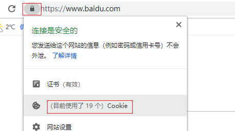

# 1. 会话技术概况

## 1.1 http协议的缺陷

http是无状态的，就是无记忆，不能让同一浏览器和服务器进行多次数据交换时，产生业务的连续性。

目前，每次请求都是独立的，没有关系的。所以服务器和客户端都不知道是否是登录过的。

## 1.2 什么是会话控制

会话控制就是弥补http无记忆的缺陷的。能够将数据持久化的保存在客户端(浏览器)或者服务器端，从而让浏览器和服务器进行多次数据交换时，产生连续性。


## 1.3 会话控制的分类

- cookie： 将数据持久化保存到**客户端**（浏览器）
- session： 将数据持久化保存到**服务器端**


# 2. cookie技术

## 2.1 什么是cookie

- cookie是将数据持久化存储到客户端的一种技术。

- 网站可以将数据写到浏览器中， 一个网站最多能在一个浏览器写20个cookie。现在的浏览器能写的更多

- 一个浏览器能够设置的总cookie数最多为300个，每个不能超过4kb。

- cookie既能保存在文件中，也能保存在内存中。

- 可以通过浏览器查看某个网站的cookie

    

## 2.2 设置cookie

- 核心： cookie是服务端设置的，随着响应头返回给浏览器的信息，浏览器要将这些信息记录下来
- 如何设置cookie
    - 使用 res.setHeader
    - 使用res.writeHead
    - 如果使用的是express框架，可以使用res.set()方法
- cookie设置格式：`key=value;expires=time`
    - key: cookie的名称
    - value： 名称对应的值
    - expires： 有效期

```js
// 所有的设置cookie，都必须写到一个请求中

//1. 使用 http模块中的setHeader 方法，它可以和sendFile一起使用
res.setHeader('set-cookie', 'id=101');                   //设置单个cookie
res.setHeader('set-cookie', ['id=101', 'name=zs']);      //设置多个cookie

//2. 使用 http模块中的writeHead 方法，它不能和sendFile及send一起使用
res.writeHead(200, {
    'content-type': 'text/html;charset=utf-8',
    'set-cookie': ['type=10', 'name=my']
})；

//3. 使用 express模块中的set 方法，该方法是express封装的方法，它可以和sendFile一起使用
res.set({
    'set-cookie':['goodsName=xiaomi 6', 'goodsPrice=3999']
})；

//4. 设置cookie时，指定有效期
//注意：要使用UTC时间，使用 toUTCString()方法转换
//设置有效期为 1小时
const expiresTime = new Date(Date.now() + 3600000).toUTCString();
res.set({
    'set-cookie':['goodsName=xiaomi 6;expires=' + expiresTime, 'goodsPrice=3999']
})
```

## 2.3 读取cookie

一旦网站在浏览器设置好cookie之后，浏览器**再访**问网站（任何页面）时，浏览器会将cookie信息随着请求头一起发送给服务器。所以我们在服务器端通过 `req.headers.cookie` 可以获取到cookie的信息。

```js
const express = require('express');
const app = express();
app.listen(3000, () => console.log('启动了'));

app.get('/captcha', (req, res) => {
    let vcode = '3Hj9';
    // 将验证码设置为cookie
    // cookie设置为响应头即可
    // res.setHeader('Set-Cookie', '名字=值');
    // res.setHeader('Set-Cookie', ['名字=值', '名字=值']);
    // res.setHeader('Set-Cookie', 'yzm=3Hj9');

    let time = new Date(Date.now() + 3600000).toUTCString();
    res.set({
        // 设置响应头
        'Content-Type': 'text/html; charset=utf-8',
        // 'Set-Cookie': ['age=20;expires=世界时间', 'name=zs', 'sex=F']
        'Set-Cookie': ['age=20;expires=' + time, 'name=zs', 'sex=F']
    });

    res.send('设置成功');
});

app.get('/login', (req, res) => {
    // 获取cookie，因为cookie中有yzm
    console.log(req.headers.cookie); // yzm=3Hj9
    res.send('获取成功');
});
```


## 2.4 cookie有效期

- 默认情况是，当关闭浏览器，cookie即消失
- 如果设置了cookie的有效期（expires），则cookie会在指定的有效期内一直存在，无论浏览器是否关闭


```js
// 设置cookie的有效期为1小时
// 方式: 先找到一小时之后的时间戳，再转为utc时间
// Date.now()： 获取当前时间点的时间戳 （毫秒数）
// Date.now() + 3600000： 一小时之后的毫秒数
// new Date(Date.now() + 3600000).toUTCString(): 将时间戳转为时间格式（UTC时间格式）
let time = new Date(Date.now() + 3600000).toUTCString();
// 设置cookie，有效期为1个小时
res.set({
    'set-cookie': ['name=zs;expires='+time]
});
```

# 3. session技术

## 3.1 session介绍

- 因为cookie是保存在客户端的数据，不够安全，所以出现了session。
- session会将数据保存到服务器端（保存在文件、内存服务器或数据表中），安全性就可以得到保证。


## 3.2 设置/读取session

express设置session时，需要使用第三方模块 --- express-session

```shell
npm i express-session

# 这个模块也可以设置session     cookie-session
```


使用步骤：

1) 加载 express-session 模块

2) 将session注册为中间件（这样，当有请求过来的时候，都会先经过中间件）

3) 使用 `req.session` 对象设置/读取session

```js
const express = require('express');
const app = express();
app.listen(3000, () => console.log('启动了'));

const session = require('express-session');
// 使用session中间件
app.use(session({ 
    secret: 'asre23s2323',  // 加密串，随便写
    cookie: { maxAge: 60000 }, // 过期时间，目前设置为 1分钟
    resave: false, // 重新保存
    saveUninitialized: false, // 即使未初始化也要保存
    // store: 保存位置 （文件、数据库中、memcache中......，保存到其他位置，还需要其他中间件）
}));

app.get('/captcha', (req, res) => {
    // 设置session
    // req.session.名字 = 值;
    req.session.yzm = 'abcd';
    req.session.isLogin = true;
    res.send('设置成功');
});

app.get('/login', (req, res) => {
    // 获取session
    console.log(req.session.yzm); // abcd
    console.log(req.session.isLogin); // true
    res.send('获取成功');
});
```

## 3.3 session有效期

- 当服务器关闭后，session消失
- express-session会将session保存在内存中，每次重启服务器时即使没有关闭浏览器session也会消失

> 学习阶段都是开发环境，服务器一会关闭了，一会开启了。
>
> 开发环境中，session是保存在内存中的，所以关闭服务器，session就消失了
>
> 生产环境中session的有效期要设置在配置项中，`cookie: {maxAge: 3600000}`，session应该保存到内存服务器中（memcache、Redis、MongoDB等）

## 3.4 删除session

核心： req.session.destroy()    销毁所有session

```js
// 删除所有session
req.session.destroy((err) => {
    if (err) {
        // 删除失败
    } else {
        // 删除成功
    }
});
```


## 3.5 session 的有效范围

在一个网站中设置了session，则整个网站都能找到这个session

# 4. cookie、sessioqn原理

cookie原理：


session原理：

服务器端会为每个用户（浏览器）各自保存一个session（文件）

下次用户再来访问的时候，就不能确定该用户的session是哪一个了

所以当服务器保存session之后，会以cookie的形式告诉浏览器，你的session是哪一个

下次再来访问服务器的时候，浏览器就会带着它自己的session号去访问，服务器就可以找到对应的session了


# 5、cookie和session的优缺点

- cookie：优点是节省服务器空间，缺点不安全。
    - 不需要特别安全的，使用cookie
    - 比如，视频观看的位置
- session：优点是安全，缺点需要服务器空间。
    - 安全性要求较高，使用session


