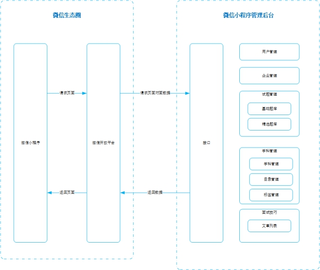
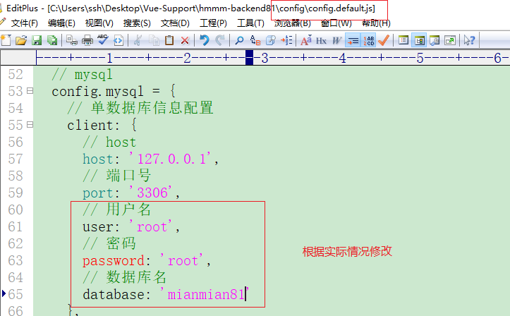

# 团队实战

## 项目开发流程

- 需求分析
- 产品设计
- psd  原型图(通过photoshop绘制项目假想效果)
- UI图(绘制项目相关图形效果)
- 后端数据接口项目开发(数据库设计、服务搭建[apache、nginx等]、开发语言[nodejs、php、python等])
- 前端项目开发，根据psd和ui绘制功能页面，大量应用第3方组件库(component)
- 前、后 端数据接口问题，**mock**假数据、在线数据，数据接口可以通过yapi管理
- **数据接口**[地址、数据] 联调  -- **禅道**管理
- 新项目、开发一半的


## 项目描述

针对目前大量学员在培训完之后直接去面试企业的通过率低的问题，公司研发了黑马面面小程序，学员在空闲时间可以通过查看企业真实面试题，不仅可以查看企业真题，也可以通过刷题寻找自己的短板进行补充，新版本提供模拟面试功能，用户可以通过微信小程序进入模拟面试模块，完成定向企业面试和自由组题模式。



项目：

- 前端项目
  - 前台项目
  - 后台项目

- 后端项目


## 后端服务api数据接口启动、停止、数据库

步骤：

1. 创建项目

   把hmmm_backend复制到 运行目录并改名字为hmmm_backend

   

2. 创建数据库、导入数据

   phpStudy启动mysql数据库

   navicat软件操作mysql数据库

   创建数据库，名称为 mianmian81

   把mianmian2.sql数据库文件导入进来

3. 给项目配置数据库账号(root/root)、mysql数据库名字(mianmian81)

   修改文件：config/config.default.js

   


4. 安装使用yarn依赖包管理工具

   安装

   ```
   npm i -g yarn     // 全局方式安装yarn依赖包 ，任何终端窗口执行都可以
   ```

   现在就可以通过yarn进行依赖包管理

   给yarn配置镜像

   ```
   yarn config set registry https://registry.npm.taobao.org		// 配置为taobao的镜像源
   yarn config get registry
   ```

   yarn的简单使用

   


5. 安装全部依赖包

```bash
yarn
```

6. 启、停 接口项目

```bash
npm start
npm stop
```

接口地址：http://127.0.0.1:7001


## 项目目录介绍

主结构文件说明：

```bash
|-- build                          # 项目构建(webpack)相关代码
|   |-- build.js                     # 生产环境构建代码
|   |-- check-version.js             # 检查node、npm等版本
|   |-- logo.png                     # logo图片
|   |-- utils.js                     # 构建工具相关
|   |-- vue-loader.conf.js				  # vue-loader配置
|   |-- webpack.base.conf.js       # webpack基础配置
|   |-- webpack.dev.conf.js        # webpack开发环境配置
|   |-- webpack.prod.conf.js       # webpack生产环境配置
|-- config                         # 项目开发环境配置
|   |-- dev.env.js                   # 开发环境配置
|   |-- index.js                   # 项目主要配置(包括监听端口，打包路径等)
|   |-- prod.env.js                  # 生产环境配置
|-- src                              # 源码目录
|   |--api
|      |-- base     # 基础接口API
|      |-- example  # 例子
|      |-- hmmm     # 功能接口API
|   |-- assets						   # 静态资源 
|   |-- components**          # vue公共组件
|   |-- filters   # 过滤器
|   |-- icons     # 图标
|   |-- lang			# 多语言切换
|   |-- mixins     # 内容合并
|   |-- mock
|   |-- module-dashboard
|   |-- module-details
|   |-- module-form
|   |-- module-hmmm   # 待完成的功能
|   |-- |--components # 组件
|   |-- |--pages      # 页面组件（包含8个页面） **重点**    
|   |-- |--router     # 模块路由
|   |-- |--store      # 存储数据
|   |-- module-list
|   |-- module-manage
|   |-- router**                   # vue路由
|   |-- App.vue**                  # 页面入口文件
|   |-- main.js**                  # 程序入口文件，加载各种公共组件
|-- static                     # 静态文件，比如一些图片，json数据等
|   |-- data                       # 群聊分析得到的数据用于数据可视化
|-- .babelrc                       # ES6语法编译配置
|-- .editorconfig                  # 定义代码格式
|-- .gitignore                     # git上传需要忽略的文件格式
|-- .postcssrc.js                  # post-loader的插件配置文件
|-- index.html                   # 模板文件页面
|-- package.json                   # 项目基本信息
|-- package-lock.json              # 锁定当前安装的包的依赖
|-- README.md                      # 项目说明
```

## 前端项目搭建

步骤：

1. 复制项目代码到运行目录(自定义的工作目录，各个目录名字不要使用中文)

   

2. 安装全部依赖包

```
yarn
```

2. 修改config/index.js文件，配置自动开启浏览器

```
autoOpenBrowser: true
```

3. 启动项目

```
npm start
```

> 确保后端项目(http://127.0.0.1:7001)已经启动


## 项目接口相关

- 接口文档：https://mock.boxuegu.com/project/113/interface/api[恢复版]

- 学员yapi应用：<http://yapi.demo.qunar.com/>

- 原型：[http://czpm.itcast.cn/黑马面面/V2.0/](http://czpm.itcast.cn/%E9%BB%91%E9%A9%AC%E9%9D%A2%E9%9D%A2/V2.0/)

- 设计稿：只做参考，主要依据原型。

  

## 分配任务

- git远程仓库： <https://gitee.com/>  码云帐号

  ​						http://github.com

- 组长

  - 创建远程仓库

  - 拉取成员进入仓库***

    - 远程仓库进入"设置"项目----->协作者------->添加协作者----->被添加者受到邮件----->接受请求即可

    

  - 上传本地代码(hmmm_frontend81)到远程仓库(默认是master分支)

  - 待各个组员开发完毕，把大家的代码合并到master分支

- 普通成员

  - git  clone 复制远程仓库内容到本地

  - 创建自己的开发分支(可以使用自己的名字拼音)并切换进入

  - 开发中。。。  

  - add/commit/push 推送自己的分支到远程仓库

  

- 在自己的分支上开发各自分配的功能

  - 基础题库
  - 精选题库
  - 题库添加
  - 组题列表
  - 学科管理
  - 目录管理
  - 标签管理
  - 面试技巧

- 组长合并分支  

现在：

1. 本地搭建后端数据接口项目

2. 分配角色：

   组长：搭建远程仓库、拉取组员、推送默认的master分支

   组员：clone仓库内容，创建开发git分支，提交分支给仓库


## 搭建两个项目

1. 后端项目 hmmm_backend

   注意：

   - ​	中文目录

   - ​	config/index.js  配置mysql的用户名、密码、数据库名字(mianmian81)  *******

   - ​	yarn  -----> node_modules (也可以复制同桌的node_modules使用)

   -   现在可以启动后端项目  npm start     

     > 不要重复执行npm  start
     >
     > 一个 npm start 要与 npm stop配合合适

2. 前端项目 hmmm_frontend

   1. 从组长的 git远程仓库 git clone 代码过来
   2. 给 复制过来的项目执行yarn 下载全部依赖包  (也可以复制同桌node_modules)
   3. 修改配置文件  ，自动开启浏览器
   4. 之后执行 npm start   ----->可以看到后台系统的登录页面的


## 相关技术点


### 修改数据库密码

登录到mysql操作命令行终端，分别依次执行如下3个指令，密码就变为123456了

```
use mysql;
update user set password=PASSWORD('123456') where user='root';
flush privileges;
```


### git简要使用

复制远程仓库

```bash
git clone "远程仓库地址" 新名称	// 获取远程仓库的master分支内容并存储到“新名称”目录里
或
git clone "远程仓库地址"	// 获取远程仓库的master分支内容并创建存储到默认目录里
```

创建本地版本分支

```bash
git checkout -b xxx    // 创建xxx的分支并切换进去
```

更新本地版本库内容

```
git pull origin master:brantest
```

> 将远程主机origin的master分支拉取过来，与本地的brantest分支合并
>
> brantest也可以不设置，默认是要与当前分支合并
>
> 执行clone指令的时候，会给当前远程仓库的连接地址创建默认的“origin”别名


### mixins

Vue实例 或 组件实例 的成员如果有很多，一并设置会造成维护难度增加，那么可以单独拆分为小部分，然后通过mixins合并

使用示例：

```js
var obj1 = {methods:{}...}
var obj2 = {filters:...}
var vm = new Vue({
  el:'#app',
  mixins:[obj1,obj2],
  data:{
    xx:xx
  }
})
效果为：
var vm = new Vue({
  el:'#app',
  methods:xxx,
  filters:xxx,
  data:{
    xx:xx
  }
})
```


### 多语言切换

安装i18n( internationalization )语言包

```
yarn add vue-i18n  // 黑马面面项目已经安装了，不用重复执行
```

在main.js中进行如下配置：

```js
import Vue from 'vue'
import App from './App'

import ElementUI from 'element-ui';
import 'element-ui/lib/theme-chalk/index.css';
// 1) 引入elementui默认提供的语言包
import enLocale from 'element-ui/lib/locale/lang/en'
import zhLocale from 'element-ui/lib/locale/lang/zh-CN'
// 2) 引入i18n的依赖包
import VueI18n from 'vue-i18n'
// 3) Vue对i18n进行注册
Vue.use(VueI18n)
Vue.use(ElementUI);

// 4) 对全部的语言进行收集，并存储到"messages对象"中
const messages = {
  en: {
    first: 'main',
    second: 'success',
    ...enLocale
  },
  zh: {
    first: '主要',
    second: '成功',
    ...zhLocale
  }
}
// 5) 实例化i18n对象，并初始化配置默认语言 和 全部语言集
const i18n = new VueI18n({
  locale: 'zh', // 配置默认语言
  messages, // 全部语言集合
})
// 6) ElementUI对语言包进行注册，使得ElementUI可以使用各种语言
Vue.use(ElementUI, {
  i18n: (key, value) => i18n.t(key, value)
})

new Vue({
  // 7) 挂载语言包
  i18n,
  render:h=>h(App)
}).$mount('#app')

```

在模板中使用语言包的各种语言，例如：

```html
<el-button type="primary">{{$t('first')}}按钮</el-button>
<el-button type="success">{{$t('second')}}按钮</el-button>
```


### 插件

插件：通过独立的模块把“Vue实例”的各个成员给设置好，待需要使用之时，快速完成配置部署，这个模块就是“插件”

使用插件

```js
Vue.use(MyPlugin)    // 本质：MyPlugin.install(Vue)
或 
Vue.use(MyPlugin, { someOption: true })

new Vue({
  // ...组件选项
})
```

> 使用插件需要在 new  Vue()之前


声明插件

```js
export default {
  install(obj){
    obj.prototype.xx = yy  // 声明全局属性，类似data
    obj.prototype.xx = ()=>{}  // 声明全局方法，类似methods
    obj.filter('timeFT',function(origin){ }) // 声明全局过滤器
    obj.component(xx,yy)  // 声明全局组件
    ……
  }
}
```

> obj 是自定义名字，代表 "Vue 构造函数" 
>
> 可以通过插件完成 data、methods、directive、filter、component等全局成员的声明


### 路由部分

暂时全部路由如下：

```
src\router\index.js    // main.js中直引
src\module-manage\router\index.js  // main.js中通过use()插件方式引入
src\module-hmmm\router\index.js  // main.js中通过 use()插件方式引入
```


### yapi应用

yapi是   高效、易用、功能强大  的数据接口管理平台
官网：<http://yapi.demo.qunar.com/>

简单使用：注册----->导入接口api.json文件----->应用


### 禅道

官网：<https://www.zentao.net/>

什么是？

禅道项目管理系统 是一款国产的，开源免费的项目管理软件，它集产品管理、项目管理、质量管理、文档管理于一体，同时它还包含了事务管理、质量管理等诸多功能。

禅道项目管理软件使用PHP+MySQL开发


功能列表：

- 产品管理：包括产品、需求、计划、发布、路线图等功能
- 项目管理：包括项目、任务、团队、版本、燃尽图等功能
- 质量管理：包括bug、测试用例、测试任务、测试结果等功能
- 文档管理：包括产品文档库、项目文档库、自定义文档库等功能
- 事务管理：包括todo管理、我的任务、我的bug、我的需求、我的项目等个人事务管理功能
- 组织管理：包括部门、用户、分组、权限等功能
- 统计功能：丰富的统计表
- 搜索功能：强大的搜索，帮助您找到相应的数据


### 配置less-loader

项目默认没有支持less，做如下配置：

运行指令：

```javascript
yarn add less-loader less -D
```

给build\webpack.base.conf.js文件相关位置做如下内容配置

```
{ test: /\.less$/, use: ['style-loader', 'css-loader', 'less-loader'] }
```


之后重启项目服务  npm start，现在vue中已经可以使用less语法了


### 数据接口相关


### git目录问题


### createAPI方法

### filters过滤器

### 插件引入各个路由

### 

